# encrypted-file-transfer
A Client-Server program that allows encrypted file transfer between the server and at least two clients. 

## Project Description
Firsy a set of symmetric session keys are exchanged between the clients and the server using ECDH. And then the file content is encrypted using a Feistel Cipher in CBC mode and transferred. 

## User Guide
### Python Libraries Required
Python Libraries Required:
- matplotlib
- tinyec
- pycryptodome
### Python Virtual Environment
The aforementioned python libraries required for this application, cannot be installed globally/system-wide on Linux machines. A python virtual environment containing a python interpreter and the aforementioned libraries has to be created to run this application.
Use the following command to create a python virtual environment:

| python3 -m venv project |
| --- |

The following image show how to do so on the terminal:
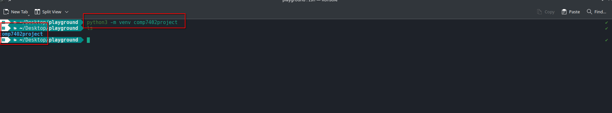
Creating python virtual environment on terminal
In order to activate the virtual environment for the current terminal session, run the following command:

| source ./project/bin/activate |
| --- |

The following image shows how to activate the virtual environment for the current terminal session:
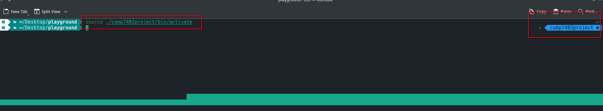
activating virtual environment
NOTE: Before running any of the python modules of this application on a terminal session, ensure that the virtual environment has been activated for that terminal first.
### Installing Required Python Libraries
Activate the virtual environment and run the following commands to install the required python libraries:

| pip install matplotlib pip install tinyecpip install pycryptodome |
| --- |

The following images shows how to install these libraries on a terminal session:
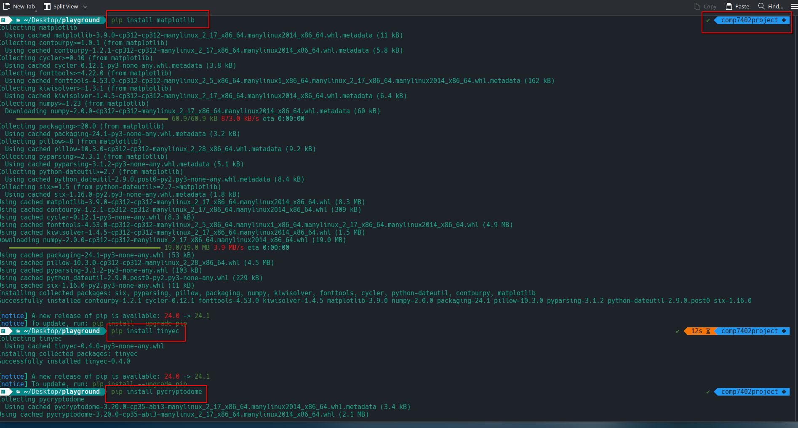
Installing required python libraries
### Network Configuration and Device Configurations

| Device Name | Device Role | Device Static Pv4 Address |
| --- | --- | --- |
| msi-pro | Server | 10.0.0.9 |
| inspiron | client1 | 10.0.0.7 |
| xps | client2 | 10.0.0.8 |

### Data Directory Structure and Files
#### /Data Directory Structure

| Subdirectory Name | Subdirectory Purpose |
| --- | --- |
| analysis | contains data files used in the analysis.docx document |
| save_directory | This directory was given as a command line argument to the application’s server component and it is where the files received by the server will be stored. |
| . | The /Data directory itself contains the data files and encrypted/decrypted files used in the testing.docx document. |

#### /Videos Directory Structure

| Video File Path | Video File Purpose |
| --- | --- |
| /Videos/server.mp4 | video of all test cases from server’s side |
| /Videos/client1.mp4 | video of all test cases from client1’s side |
| /Videos/client2.mp4 | video of all test cases from client2’s side |

#### /’Packet Captures’ Directory Structure

| Pcaps File Path | Pcaps File Purpose |
| --- | --- |
| /Videos/server.pcapng | packets captured on server |
| /Videos/client1.pcapng | packets captured on client1 |
| /Videos/client2.pcapng | packets captured on client2 |

#### /Documents Directory Structure

| Document Name | Document Purpose |
| --- | --- |
| testing.docx | contains all the test cases |
| analysis.docx | contains avalanche effect analysis and so on |
| user_guide.docx | the user guide for the application |
| design.docx | the design document |

### Python Modules Run-down

| Module Name | Module Purpose |
| --- | --- |
| Source/cipher.py | Implements the encryption and decryption functionality of the application. In addition, this module can encrypt/decrypt image files locally. |
| Source/networking.py | Implements the networking aspect of the application. Provides an API to send and receive various control packets and data packets between a server and multiple clients. |
| Source/client.py | Implements the client functionality of the application. Connects to the server and transfers the specified file to the server. |
| Source/server.py | Implements the server functionality of the application. Listening on the port specified and on the default IPv4 address and accepts client connections and initiates a thread to handle each individual client connection. |
| Source/analysis.py | Contains the functions and code used for the analysis of this project used in the analysis document. |

#### Module cipher.py Configurations
- The IV or main key has a hex number with the leading 0X that is exactly 32 digits long excluding the leading 0x, e.g., 0x0000000000000000000000000000000f.
- Both lowercase characters and uppercase can be used.

| Flag | Short Form | Flag Argument | Required | Purpose |
| --- | --- | --- | --- | --- |
| --operation | -op | encryption(e) decryption(d) | yes | Specifies the operation to perform. Either encryption or decryption. |
| --input | -in | relative or absolute file | yes | Specifies the file to be encrypted/decrypted. |
| --out | -o | relative or absolute file | yes | Specifies path/name of the file which will contain the transformed/encrypted/decrypted input file |
| --iv | -iv | Initialization Vector | Required for decryption. Optional for encryption. | Specifies the IV to be used for encryption or the IV used during the encryption which will be used for decryption. This option is required if the operation is decryption and optional if the operation is encryption. If no IV is provided for encryption, an IV will be automatically generated and displayed on the screen. |
| --mainkey | -k | The main key that is used to generate subkeys. | Required for decryption. Optional for encryption. | Specifies the main key used for encryption when trying to decrypt or specifies the main key to use for encryption. This option is optional for encryption and if no value is provided, an auto-generated main key will be generated and printed onto the screen. |
| --headersize | -hs | Integer specifying the size of the input file header section in bytes. | Optional | This flag specifies the number of bytes of the header section of the input file. The first number of bytes specified by this flag are not encrypted/decrypted and unchanged and they will be written to the output file as they are. Specify 0 if working with text files. The default value is 54 bytes which is used for the bitmap images |

| python3 cipher.py -h usage: cipher.py [-h] -op OPERATION -in INPUT -out OUTPUT [-k MAINKEY] [-iv IV] [-hs HEADERSIZE] ... options: -h, --help            show this help message and exit -op OPERATION, --operation OPERATION -in INPUT, --input INPUT -out OUTPUT, --output OUTPUT -k MAINKEY, --mainkey MAINKEY -iv IV, --iv IV -hs HEADERSIZE, --headersize HEADERSIZE |
| --- |

The following screenshot shows usage of cipher.py:
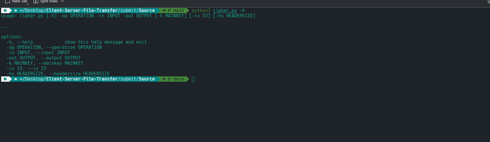
#### Module client.py Configurations

| Flag | Short Form | Flag Argument | Required | Purpose |
| --- | --- | --- | --- | --- |
| --serveraddress | -sa | IPv4 address of server | Yes | Specifies the IPv4 address of the server |
| --serverport | -sp | Port number server is listening on | Yes | Specifies the port that the server is listening on. |
| --filepath | -sp | Relative or Absolute path to a file. | Yes | Specifies the file to the server. |
| --verbosity | -v | low(l), medium(m), high(h) | No | Amount of info to print. Low only prints server/client address and ports. Medium prints the control, packets such as public key packet, file name packet, IV packet, and EOT packet. High Prints all packets including every single data packet. |

| python3 client.py -h usage: client.py [-h] -sa SERVERADDRESS -sp SERVERPORT -fp FILEPATH [-v VERBOSITY] ... options: -h, --help            show this help message and exit -sa SERVERADDRESS, --serveraddress SERVERADDRESS Server IPv4 Address. -sp SERVERPORT, --serverport SERVERPORT Server port number. -fp FILEPATH, --filepath FILEPATH Path of file to transfer. -v VERBOSITY, --verbosity VERBOSITY verbosity level: low(l), medium(m), high(h) |
| --- |

The following screenshot shows the usage of client.py
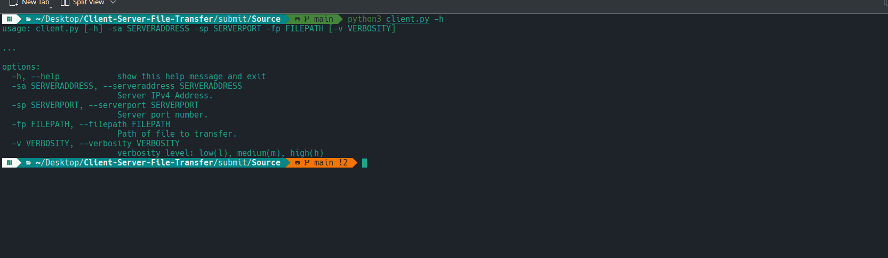
#### Module server.py Configurations

| Flag | Short Form | Flag Argument | Required | Purpose |
| --- | --- | --- | --- | --- |
| --serverpor | -sp | Integer port number | Yes | The port number the server will begin listening on. |
| --savedirectory | -sd | Relative or Absolute path to a directory | Yes | The directory where the files received by the server will be stored. |
| --verbosity | -v | low(l), medium(m), high(h) | No | Amount of info to print. Low only prints server/client address and ports. Medium prints the control, packets such as public key packet, file name packet, IV packet, and EOT packet. High Prints all packets including every single data packet. |

| python3 server.py -h usage: server.py [-h] -sp SERVERPORT -sd SAVEDIRECTORY [-v VERBOSITY] ... options: -h, --help            show this help message and exit -sp SERVERPORT, --serverport SERVERPORT Port number to run server on. -sd SAVEDIRECTORY, --savedirectory SAVEDIRECTORY Path of directory where files are stored.. -v VERBOSITY, --verbosity VERBOSITY verbosity level: low(l), medium(m), high(h) |
| --- |

The following screenshot shows the usage of server.py:
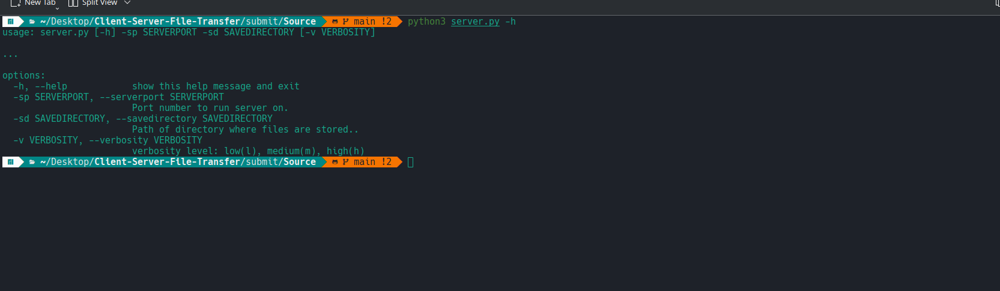

## Design Document

## Server
### Server FSM
The following shows the FSM for the server component:
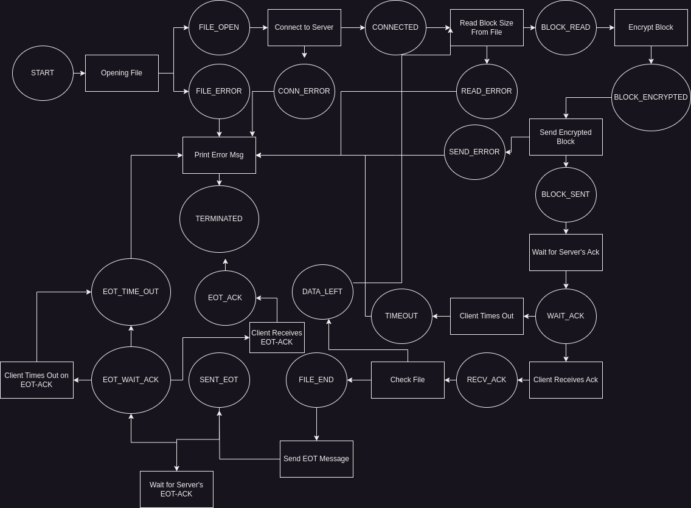
### Server State Description Table

| STATE | STATE DESCRIPTION |
| --- | --- |
| START | The point when the client begins execution. |
| FILE_OPEN | If the client was able to successfully open the file that is going to be transferred to the server. |
| FILE_ERROR | If there was an issue opening the file that was meant to be transferred to the server. |
| CONN_ERROR | If there was an error connecting to the server. |
| CONNECTED | If the client successfully was able to connect to the server and finish the 3-way handshake. |
| READ_ERROR | If there was an issue reading from the file. |
| BLOCK_READ | If a certain number of bytes equal to the size of the block cipher in use was read successfully. |
| BLOCK_ENCRYPTED | When the client encrypts the block that was recently read. |
| SEND_ERROR | If there was an issue sending the encrypted block to the server. |
| BLOCK_SENT | If the encrypted block was successfully sent through the channel. |
| WAIT_ACK | The encrypted block has been sent through the channel and the client is waiting for the server acknowledgment of the packet that the client sent. |
| TIME_OUT | If the client does not receive an acknowledgment from the server within the specified amount of time. |
| RECV_ACK | If the client received an acknowledgment from the server within the specified amount of time. |
| FILE_END | When the entire content of the file has been sent, there is nothing left to send. |
| DATA_LEFT | If there is still data left in the file that needs to be sent |
| SENT_EOT | The client has sent the entire content of the file in addition to an EOF message to terminate the connection. |
| EOT_WAIT_ACK | When the client is waiting for the server to acknowledge the EOT message sent. |
| EOT_TIME_OUT | When the client has not received the ack to EOF message within the specified amount of time. |
| EOT_ACK | When the client has received the ack to EOF message within the specified amount of time. |
| TERMINATED | When the client has finished its job and has terminated. |

### Server Pseudocode
The following is the pseudocode for the server component:

| LISTEN on PORT 8080 and on default IPv4 address WHILE TRUE: WAIT for a client to connect RUN THREAD clientThreadFunction() with connected client info FUNCTION clientThreadFunction(clientInfo): RECV client's public key SEND ACK to acknowledge client public key GENERATE self private-public key pairs SEND self public key to client WAIT for ACK for self public key DERIVE symmetric session key based of self private key and client public key RECV file name from client SEND ACK to acknowledge file name RECV IV from client SEND ACK to acknowledge IV DERIVE list of subkeys for each round based on symmetric session key OPEN FILE WHILE EOT packet has not been received: RECV data packet from client SEND ACK to acknowledge data packet received DECRYPT data packet with the subkey list IF data packet received is PARTIAL_PACKET: UNPAD decrypted packet WRITE decrypted packet to file SEND ACK to acknowledge EOT CLOSE FILE |
| --- |

## Client
### Client FSM:
The following shows the FSM for the client component:
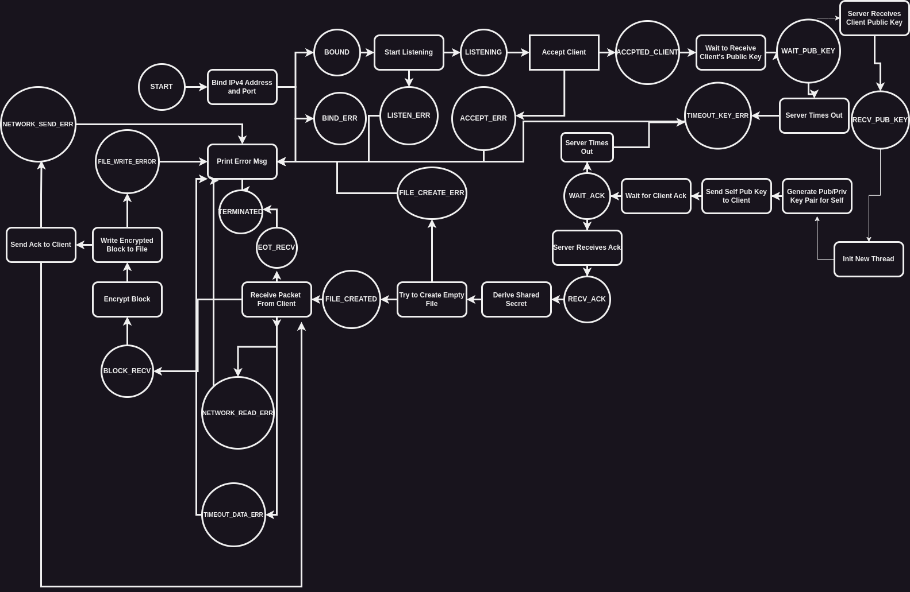
## Client State Description Table

| STATE | STATE DESCRIPTION |
| --- | --- |
| START | When program execution starts. |
| BIND_ERR | If the program fails to bind the given IPv4 address and port number. |
| BOUND | If the program successfully binds to the given IPv4 address and port number. |
| LISTENING | If the program successfully starts listening to any possible clients that are trying to connect. |
| LISTEN_ERR | If there is an issue, start listening to any possible clients. |
| ACCEPT_ERR | If failed to accept a client for any reason. |
| ACCEPTED_CLIENT | If successfully accepted by a client. |
| WAIT_PUB_KEY | While waiting for the client to send its public key over. |
| TIMEOUT_KEY_ERR | If the server did not receive the client’s public key within the amount of time specified. |
| RECV_PUB_KEY | If the server did receive the client’s public key within the specified amount of time. |
| WAIT_ACK | When the server sends its public key to the client and is waiting for the client to confirm that the client indeed received the server’s public key. |
| RECV_ACK | When the server receives the client’s confirmation of the server’s public key. |
| FILE_CREATE_ERR | If there was an issue creating the file that is meant to contain the file to be transferred over the network. |
| FILE_CREATED | If the file was created successfully. |
| EOT_RECV | If the server received an End of Text(EOT) packet signifying the end of the network connection. |
| NETWORK_READ_ERR | If there was an issue reading a packet from the client. |
| TIMEOUT_DATA_ERR | If no EOT packets or data packets were received by the server within the given amount of time. |
| BLOCK_RECV | When the server receives a data packet containing an encrypted block of data. |
| FILE_WRITE_ERR | If there was an issue writing the decrypted block to the file. |
| NETWORK_SEND_ERR | If there wan an issue ending an acknowledgment to a client packet. |
| TERMINATED | When the program stops execution. |

### Client Pseudocode
The following shows the pseudocode for the client component:

| CONNECT to server at 10.0.0.9 listening on PORT 8080 GENERATE self private-public key pairs SEND self public key to server WAIT for ACK RECV server's public key SEND ACK to acknowledge server's public key DERIVE symmetric session key based on self private key and server's public key SEND file name to server WAIT for ACK SEND IV to server WAIT for ACK RUN THREAD fileTransfer() with server info FUNCTION fileTransfer(serverInfo): DERIVE subkey list for each round OPEN file WHILE end of file has not been reached: READ 16 bytes or less from file IF less than 16 bytes was read: PAD to make block read 16 bytes ENCRYPTED block with subkey list IF less than 16 bytes was read: SEND PARTIAL_PACKET along with unpadded size of block IF 16 bytes was read from file: SEND FULL_PACKET WAIT for ACK SEND EOT packet to close session WAIT for ACK to EOT packet sent CLOSE file |
| --- |

## Packet Design
- The first byte indicates the type of the packet.
- The second byte may indicate some value(e.g., actual data size without padding).
- The rest of the bytes may be data bytes or meaningless bytes.

| Flag Value | Flag Description |
| --- | --- |
| 0X01 | Public key. |
| 0X02 | File name ( the second byte indicates the length of the file name in bytes). |
| 0X03 | IV |
| 0X04 | EOT |
| 0x05 | ACK (the second byte indicates what is being ACKed, signal bytes). |
| 0x06 | Full payload with NO paddings. |
| 0x07 | partial payload padded (second bytes indicates the actual size of the block excluding the padding). |

### Packet Types

| 66 Bytes |
| --- |

| Index | Flag(1 Byte) | Param(1 Byte) | Data(64 Byte) |
| --- | --- | --- | --- |
| 1 | 0X01 | 0X** | 0x**0x**0x**0x**0x**0x**0x**0x**0x**0x**0x**0x**0x**0x**0x**0x**0x** 0x**0x**0x**0x**0x**0x**0x**0x**0x**0x**0x**0x**0x**0x**0x**0x**0x** 0x**0x**0x**0x**0x**0x**0x**0x**0x**0x**0x**0x**0x**0x**0x**0x**0x** 0x**0x**0x**0x**0x**0x**0x**0x**0x**0x**0x**0x**0x**0x**0x**0x**0x** |

| 18 Bytes |
| --- |

| Index | Flag(1 Byte) | Param(1 Byte) | Data(16 Byte) |
| --- | --- | --- | --- |
| 2 | 0X02 | 0X** | 0x**0x**0x**0x**0x**0x**0x**0x**0x**0x**0x**0x**0x**0x**0x**0x**0x** |
| 3 | 0X03 | 0X** | 0x**0x**0x**0x**0x**0x**0x**0x**0x**0x**0x**0x**0x**0x**0x**0x**0x** |
| 4 | 0X04 | 0X** | 0x**0x**0x**0x**0x**0x**0x**0x**0x**0x**0x**0x**0x**0x**0x**0x**0x** |
| 5 | 0X05 | 0X01 | 0x**0x**0x**0x**0x**0x**0x**0x**0x**0x**0x**0x**0x**0x**0x**0x**0x** |
| 6 | 0x05 | 0X02 | 0x**0x**0x**0x**0x**0x**0x**0x**0x**0x**0x**0x**0x**0x**0x**0x**0x** |
| 7 | 0X05 | 0X03 | 0x**0x**0x**0x**0x**0x**0x**0x**0x**0x**0x**0x**0x**0x**0x**0x**0x** |
| 8 | 0X05 | 0X04 | 0x**0x**0x**0x**0x**0x**0x**0x**0x**0x**0x**0x**0x**0x**0x**0x**0x** |
| 9 | 0X05 | 0X06 | 0x**0x**0x**0x**0x**0x**0x**0x**0x**0x**0x**0x**0x**0x**0x**0x**0x** |
| 10 | 0X05 | 0X07 | 0x**0x**0x**0x**0x**0x**0x**0x**0x**0x**0x**0x**0x**0x**0x**0x**0x** |
| 11 | 0X06 | 0X** | 0x**0x**0x**0x**0x**0x**0x**0x**0x**0x**0x**0x**0x**0x**0x**0x**0x** |
| 12 | 0X07 | 0X** | 0x**0x**0x**0x**0x**0x**0x**0x**0x**0x**0x**0x**0x**0x**0x**0x**0x** |

### Packet Types Description

| PACKET INDEX | PACKET DESCRIPTION |
| --- | --- |
| 1 | The packet initiates the connection that contains the public key. The X and Y coordinates of the public key are encoded as two consecutive 256-bit bytes which means the payload of this packet is (256bit * 2) / 8 bit/byte = 64 Bytes |
| 2 | The packet that declares the name of the file. |
| 3 | The packet that contains the initialization vector used for CBC encryption and decryption. |
| 4 | The packet terminates the connection, i.e., EOT packet. |
| 5 | Acknowledgment packet acknowledging the public key of the peer. |
| 6 | Acknowledgment packet acknowledging the name of the file. |
| 7 | Acknowledgment packet acknowledging the initialization vector used. |
| 8 | Acknowledgment packet acknowledging to the peer that it received the end of the text or connection packet, EOT. |
| 9 | Acknowledgment packet arrival of a full payload packet sent by the peer. |
| 10 | Acknowledgment packet arrival of a partial payload packet sent by the peer. |
| 11 | A full payload. |
| 12 | A parietal payload. |

### Shared Secret Derivation Pseudocode

| FUNCTION deriveSymmetricSessionKey(selfPrivKey, peerPublicKeyPoint): DERIVE shared point by MULTIPLYING selfPrivKey and peerPublicKeyPoint XOR shared point's X coordinate with shared point's Y coordinate CONVERT the XORed result to bytes in big endian order HASH the converted bytes using sha256 RETURN the first 16 bytes of the hashed value |
| --- |

### Subkey Generation Pseudocode

| FUNCTION deriveSubkeys(sessionKey): INITIALIZE an empty list to hold subkeys for each round FOR index in 16 rounds: CONVERT index number to 16 bytes in big endian order HASH the converted bytes using sha256 APPEND the first 16b bytes of the hash to the subkey list RETURN the subkey list |
| --- |

### Round Function Pseudocode

| FUNCTION roundFunc(rightSide, roundKey): XOR rightSide with roundKey CALL permutate() function passing the xored result as parameter RETURN the return value of permutate() function FUNCTION permutate(inputBytes): hash inputBytes using sha256 extract the first 8 bytes of the hash convert the 8 bytes extracted to an integer in big endian order SET RANDOM module SEED to this integer INIT list containing elements 1 through 64 SHUFFLE the list using RANDOM module to create a permutation of the list CONVERT inputBytes to integer in big endian order PERMUTATE the bits of the integer form of inputBytes according to the permuted list CONVERTED the integer back to 8 bytes RETURN the converted bytes |
| --- |

## Analysis Document
### Overview of Module analysis.py
The module analysis.py has all the functionality that will be used to analyze the
cipher developed for this assignment.
The notable functions of analysis.py module that will be used to perform Avalanche Effect conditions SPAC and SKAC are as follows:
#### SPAC Function

| def SPAC(originalPlaintextInt, modifiedPlaintextInt, mainkeyint, imgSavePath) |
| --- |

- This function performs SPAC.
- This function takes the original plaintext, the modified plaintext, and the mainkey as 32-bit hex numbers as the first, second, and third arguments respectively.
- The 32bit numbers have to be in the format 0xffffffffffffffffffffffffffffffff.
- This function also takes a filename that will be used to name a chart.
- The chart has 16 bars each corresponding to the 16 rounds of the cipher.
- Each bar represents the count of differing bits between the two ciphertexts resulting from encrypting the original plaintext and the modified plaintext.
- Also, this function returns the number of differing bits for round 1-16 as a list of integers.
#### SKAC Function

| def SKAC(originalPlaintextInt, originalMainkeyInt, modifiedMainkeyInt, imgSavePath) |
| --- |

- This function performs SKAC.
- This function takes the plaintext, mainkey, and modified mainkey as 32-bit hex numbers as the first, second, and third arguments respectively.
- The 32bit numbers have to be in the format 0xffffffffffffffffffffffffffffffff.
- This function also takes a filename that will be used to name a chart.
- The chart has 16 bars each corresponding to the 16 rounds of the cipher.
- Each bar represents the count of differing bits between the two ciphertexts resulting from encrypting the plaintext with the original main key and the modified main key.
- Also, this function returns the number of differing bits for round 1-16 as a list of integers.
### Analyzing SPAC of Cipher
### Confusion
- Confusion obscures the relationship between the ciphertext and key.
- A single bit change in the key causes many changes in the ciphertext bits.
- Relationship between the statistics of the ciphertext and the value of the encryption key is designed to be as complex as possible.
### Strict Plaintext Avalanche Criterion (SPAC)
- Each bit of the ciphertext block should change with the probability of one-half whenever any bit of the plaintext is changed.

| Original Plaintext | 0xcb58dc99fb1496a1e6d5ec09453aa801 |
| --- | --- |
| Original Main Key | 0xe5f10672c7e7aaa2f23077c249f20f91 |
| Modified plaintext with 1 bit change | 0xcb58dc99fb1496a1e6d5ec09453aa802 |
| Modified plaintext with 2 bit change | 0xcb58dc99fb1496a1e6d5ec09453aa803 |

#### SPAC 1 Bit Change
Count of differing bits rounds 1-16 for SPAC with 1 bit change:
[32, 58, 54, 52, 66, 72, 62, 66, 76, 70, 56, 62, 74, 72, 66, 60]
As it can be seen in the number of bits differing from round 1 to round 16, it starts at 32bits and increases all the way to 76bits in round 9 and then declines to 60bits in round 16.
Taking the number of bits of round 16, 60bits, and dividing it by the total number of bits, 128bits=16bytes, 60bits/128bits = 0.46875%. 0.46875% of the bits differ which is really close to the target global of 50%.
The following chart shows the number of bits differing per round for SPAC with 1 bit change:
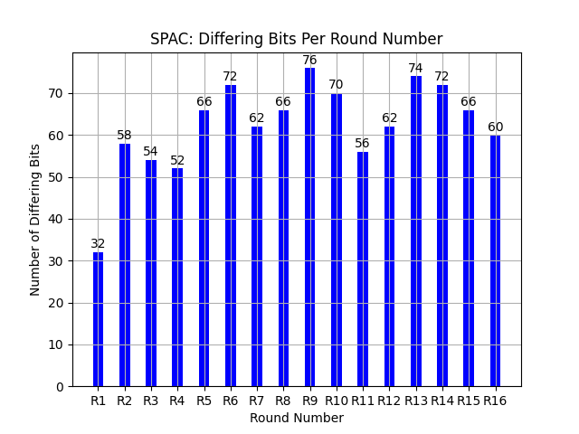
/Data/analysis/SPAC_1bit.png
#### SPAC 2 Bit Change
Count of differing bits rounds 1-16 for SPAC with 2 bit change:
[34, 65, 67, 62, 65, 69, 60, 59, 65, 70, 67, 63, 68, 63, 53, 60]
As it can be seen, in the first round it starts with 34bits and rises all the way to 70bits in round 10 and then declines to 60bits in round 16. Taking the value of round 16, 60bits and dividing it by the total number of bits, 128bits, 60bits/128bits = 0.46875%, results in 0.46875% of the bits changing which is really close t0 50% target.
The following chart shows the number of bits differing per round for SPAC with 2 bit change:
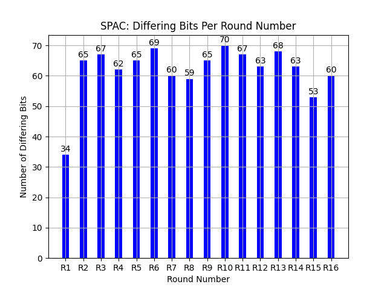
/Data/analysis/SPAC_2bit.png
### Analyzing SKAC of Cipher
### Diffusion
- Diffusion distributes the plaintext statistics throughout the ciphertext in order to obscure the statistical characteristics of the plaintext.
- If one bit of the ciphertext is changed, then approximately one-half of the plaintext bits should change.
### Strict Key Avalanche Criterion (SKAC)
For a fixed plaintext block, each bit of the ciphertext block should change with the probability of one-half whenever any bit of the key is changed.

| Original Plaintext | 0xcb58dc99fb1496a1e6d5ec09453aa801 |
| --- | --- |
| Original Main Key | 0xe5f10672c7e7aaa2f23077c249f20f91 |
| Modified main key with 1 bit change | 0xe5f10672c7e7aaa2f23077c249f20f92 |
| Modified main key with 2 bit change | 0xe5f10672c7e7aaa2f23077c249f20f93 |

#### SKAC 1 Bit Change
Count of differing bits rounds 1-16 for SKAC with 1 bit change:
[34, 54, 48, 65, 62, 60, 65, 60, 63, 63, 61, 65, 64, 55, 64, 71]
As it can be seen, in round 1 it starts at 34bits and rises all the way to 71bits in round 16.
Taking the value for round 16, 71bits, and dividing it by the total number of bits, 128bits,
71bits/128bits = 0.5546875%, results in 0.5546875% of the bits chaning which is more than the target global of 50%.
The following chart shows the number of bits differing per round for SKAC with 1 bit change:
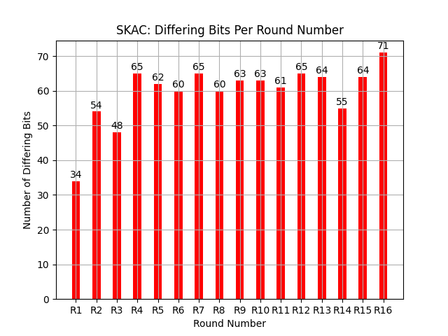
/Data/analysis/SKAC_1bit.png
#### SKAC 2 Bit Change
Count of differing bits rounds 1-16 for SKAC with 2 bit change:
[30, 64, 67, 67, 68, 62, 60, 66, 65, 62, 67, 59, 46, 58, 70, 74]
As it can be seen, in the first round, it starts at 30bits and rises up all the way up to 74bits in round 16. Taking the value of round 16, 74bits, and dividing it by the total number of bits, 128bits, 74bits/128bits = 0.578125%, results in 0.578125% of the bits changing which is well above the 50% target goal.
The following chart shows the number of bits differing per round for SKAC with 2 bit change:
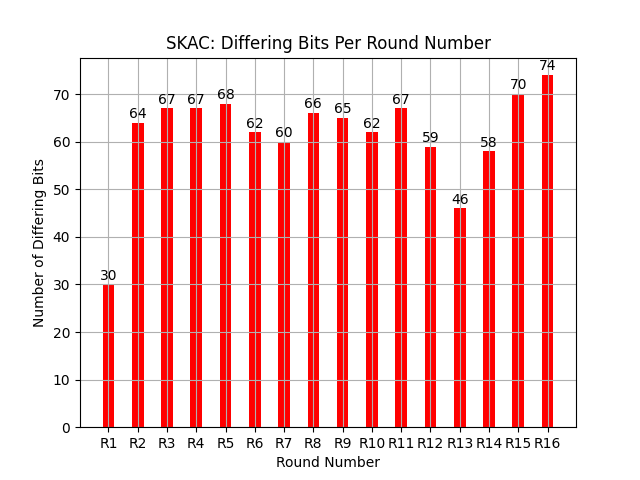
/Data/analysis/SKAC_2bit.png
The following image shows the usage of analysis.py module used to obtain the data:
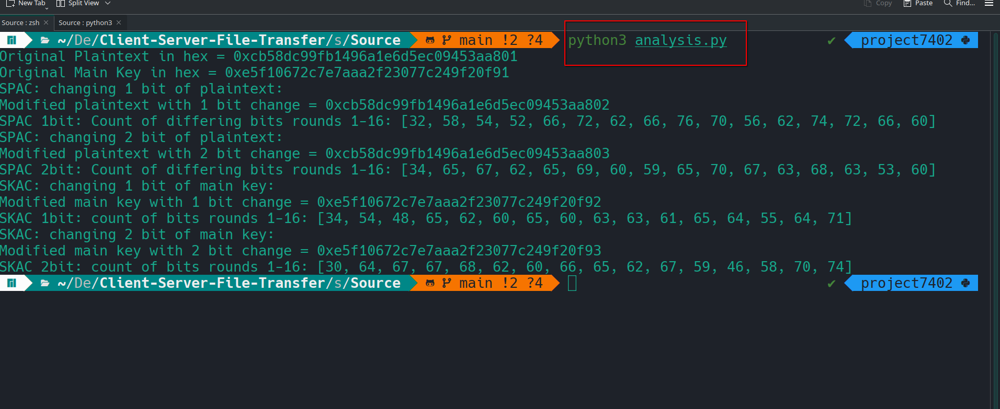
Usage of analysis.py
#### Image Encryption and Decryption
The following image will be used for encryption:

/Data/analysis/plaintext_img.bmp
#### Image Encryption
Run the following command to encrypt the image:

| python3 cipher.py --input ./plaintext_img.bmp --output ciphertext_img.bmp --operation encrypt |
| --- |

Auto-generated main key an IV:
Main Key: 0x05523742e78a566e3e3207ce80b7ca28
IV used: 0xb0bd519a487e5825a7b82496ec25dcd5
The following screenshot shows the encryption process:
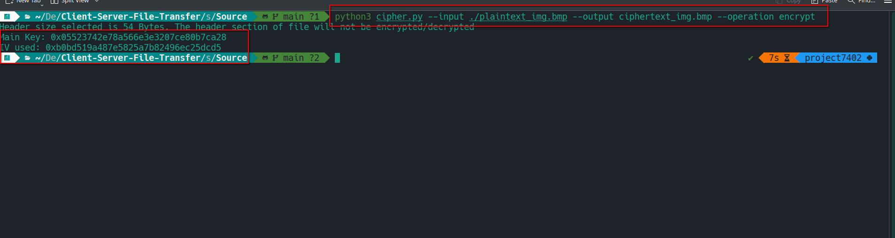
Encrypting plaintext_img.bmp
The following image shows the encrypted image:

/Data/analysis/ciphertext_img.bmp
#### Image Decryption
Run the following command to decrypt the encrypted image:

| python3 cipher.py --input ./ciphertext_img.bmp --output decrypted_plaintext_img.bmp --operation decrypt --mainkey 0x05523742e78a566e3e3207ce80b7ca28 --iv 0xb0bd519a487e5825a7b82496ec25dcd5 |
| --- |

The following screenshot shows the decryption process:
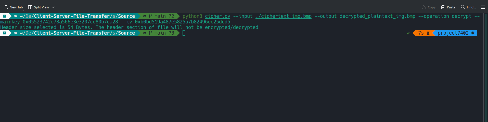
Decrypting the encrypted image
The following is the decrypted image:

/Data/analysis/decrypted_plaintext_img.bmp

## Test Document
### Test Cases Run-down
- The server will be listening on port 8080 for connections in all of the examples below.
### Network and Machine Configuration

| Device Name | Device Role | Device Static IPv4 Address |
| --- | --- | --- |
| inspiron | Client1 | 10.0.0.7 |
| xps | Client2 | 10.0.0.8 |
| msi-pro | Server | 10.0.0.9 |

### Test Case Description Table

| Test Case Number# | Test Case Description | Test Case Status |
| --- | --- | --- |
| 1 | Sending a large text file from Client1 and Client2 to the server at the same time. The same text file is sent from both client1 and client2. | Passed |
| 2 | Sending  a text file whose size is exactly 15 bytes from both Client1 and Client2 to the server at the same time. Since the cipher block size for this project is 16 bytes, the value sending a 15 byte long text file here is intended to test the edge cases. | Passed |
| 3 | Sending  a text file whose size is exactly 17 bytes from both Client1 and Client2 to the server at the same time. Since the cipher block size for this project is 16 bytes, the value sending a 17 byte long text file here is intended to test the edge cases. | Passed |
| 4 | Sending an image file from both Client1 and Client2 to the server at the same time. | Passed |
| 5 | Encrypting an image file and then decrypting the encrypted image file verifying that the decrypted image file and the original image file are identical. | Passed |

| Hints Table |
| --- |
| The large text file used was found from: https://www.gutenberg.org/cache/epub/73877/pg73877.txt The large text file was renamed to “book.txt” and it’s full file path is /Data/book.txt |
| The following image was used for text case []  that encrypts and decrypts an image. The full path of the image file is /Data/image.bmp. It is also used for the test case []. This is the image: 
 |
| The file /Data/byte15.txt is the text file used for test case []. This file is exactly 15 bytes. 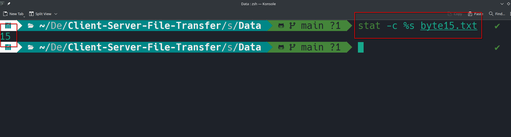 |
| The file /Data/byte17.txt is the file used for test case []. This file is exactly 17 bytes.  |

### Wireshark Capture Filters

| Server | (host 10.0.0.9 and host 10.0.0.8) or (host 10.0.0.9 and host 10.0.0.7) |
| --- | --- |
| Client1 | (host 10.0.0.9 and host 10.0.0.7) |
| Client2 | (host 10.0.0.9 and host 10.0.0.8) |

The following is the capture filter for server machine:
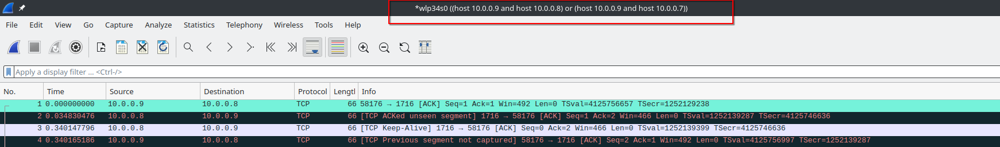
The following is the capture filter for client1 machine:
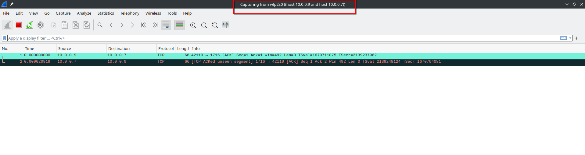
The following is the capture filter for client2 machine:
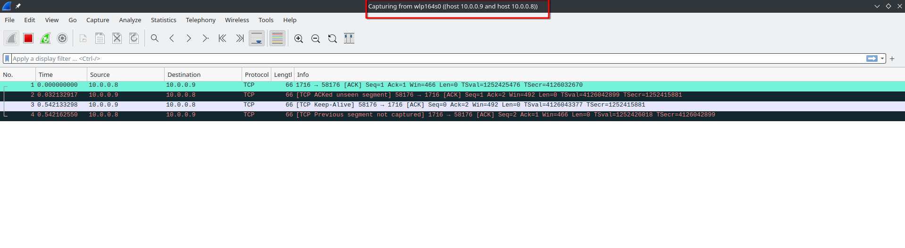
### Test Case Data Files and Directories
NOTE: There are 3 copies of every data file in the /Data directory. The names of 2 of the 3 copies end in “_cli1” and ‘_cli2” indicating which file was sent from which client. Only the name of the copies are different and their content is exactly the same
NOTE: the “/Data/store_dir” directory is passed to the server application as the location where the files received by the server will be stored.
#### Test Case 1 

| Machine | Test Case Command |
| --- | --- |
| server/msi-pro | python3 ./Source/server.py  --serverport 8080  --savedirectory ./Data/save_directory --verbosity medium |
| client1/inspiron | python3 ./Source/client.py --serveraddress 10.0.0.9 --serverport 8080 --filepath ./Data/book_cli1.txt |
| client2/xps | python3 ./Source/client.py --serveraddress 10.0.0.9 --serverport 8080 --filepath ./Data/book_cli2.txt |

Running server command:
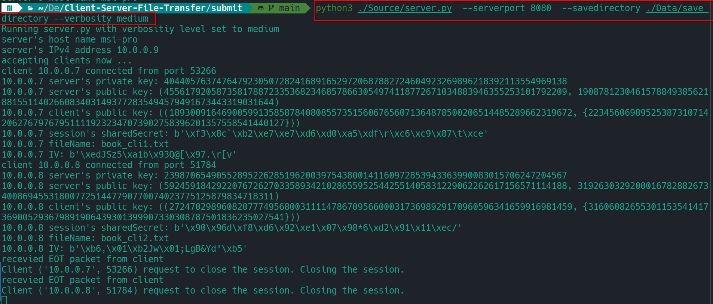
Running client 1 command:
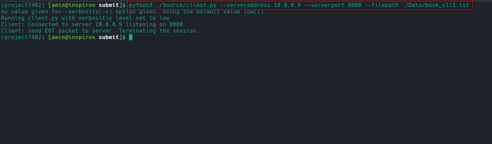
Running client 2 command:
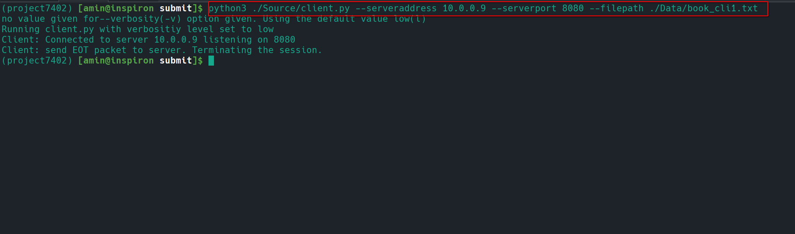
Using linux `diff` command to demonstrate that files sent from client1 and client2 are identical:
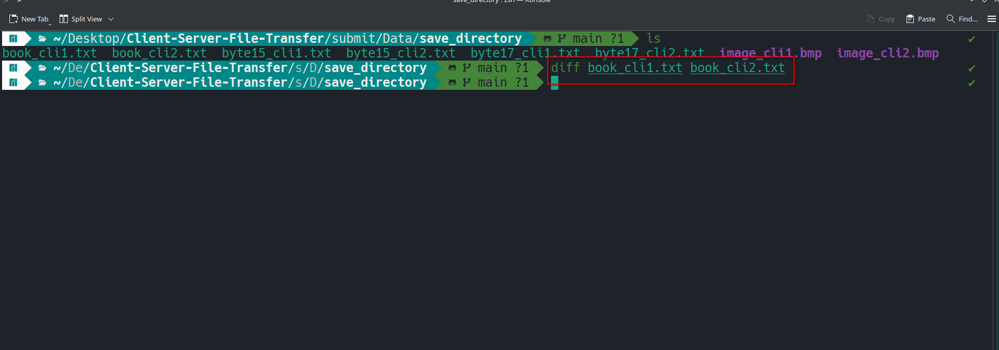
#### Test Case 2 

| Machine | Test Case Command |
| --- | --- |
| -server/msi-pro | python3 ./Source/server.py  --serverport 8080  --savedirectory ./Data/save_directory --verbosity high |
| client1/inspiron | python3 ./Source/client.py --serveraddress 10.0.0.9 --serverport 8080 --filepath ./Data/byte15_cli1.txt |
| client2/xps | python3 ./Source/client.py --serveraddress 10.0.0.9 --serverport 8080 --filepath ./Data/byte15_cli2.txt |

Running server command:
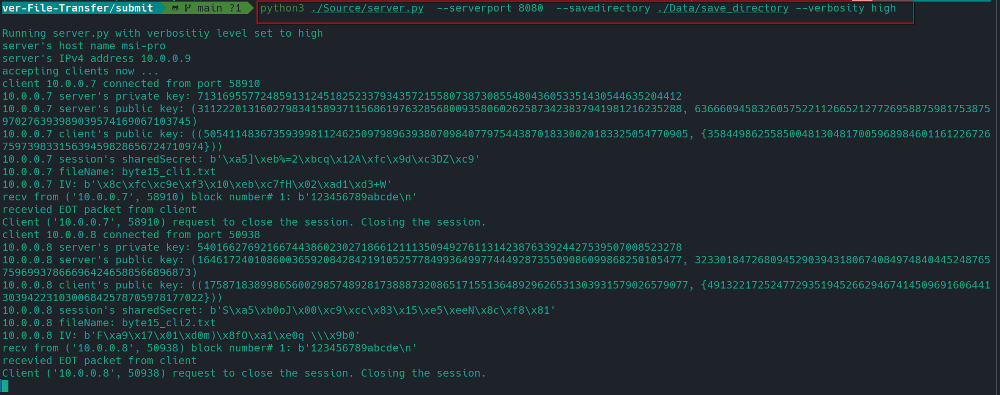
Running client1 command:
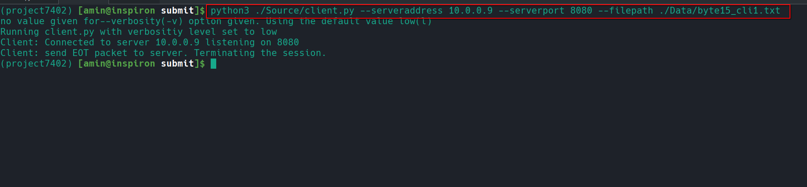
Running client2 command:
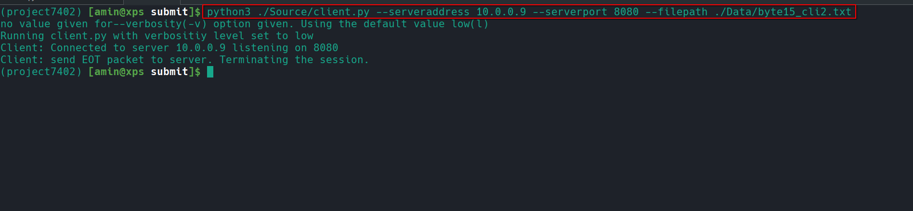
Using linux `diff` command to demonstrate that files sent from client1 and client2 are identical:
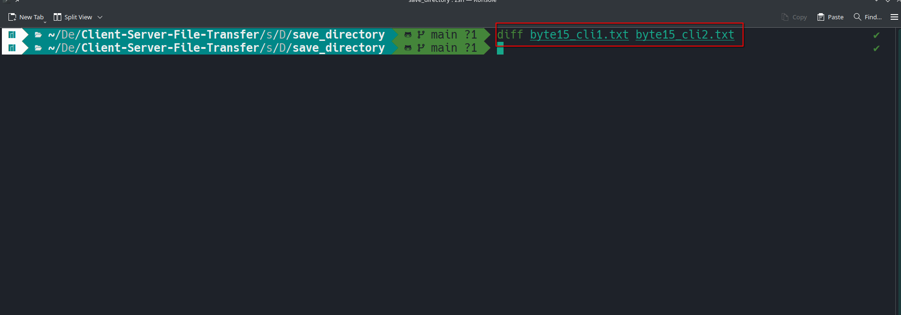
#### Test Case 3 

| Machine | Test Case Command |
| --- | --- |
| server/msi-pro | python3 ./Source/server.py  --serverport 8080  --savedirectory ./Data/save_directory --verbosity high |
| client1/inspiron | python3 ./Source/client.py --serveraddress 10.0.0.9 --serverport 8080 --filepath ./Data/byte17_cli1.txt |
| client2/xps | python3 ./Source/client.py --serveraddress 10.0.0.9 --serverport 8080 --filepath ./Data/byte17_cli2.txt |

Running server command:
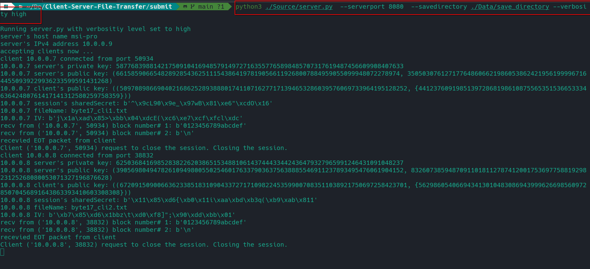
Running client1 command:
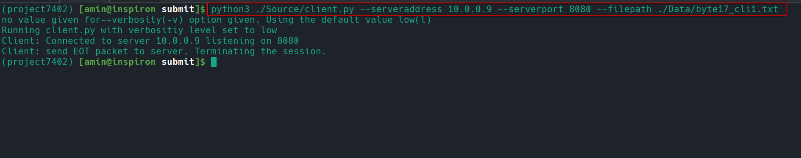
Running client2 command:
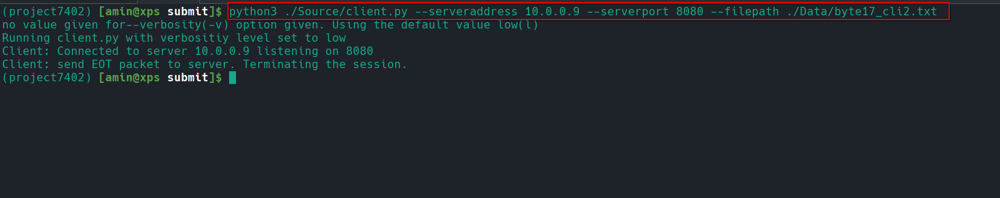
Using linux `diff` command to demonstrate that files sent from client1 and client2 are identical:

#### Test Case 4 

| Machine | Test Case Command |
| --- | --- |
| server/msi-pro | python3 ./Source/server.py  --serverport 8080  --savedirectory ./Data/save_directory --verbosity medium |
| client1/inspiron | python3 ./Source/client.py --serveraddress 10.0.0.9 --serverport 8080 --filepath ./Data/image_cli1.bmp --verbosity  medium |
| client2/xps | python3 ./Source/client.py --serveraddress 10.0.0.9 --serverport 8080 --filepath ./Data/image_cli2.bmp --verbosity  medium |

Running server command:
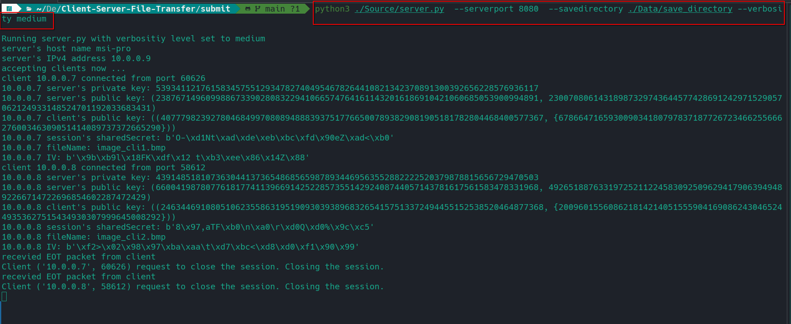
Running client1 command:
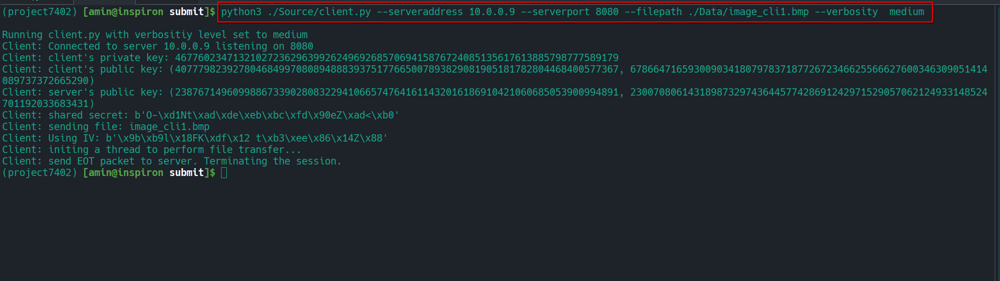
Running client2 command:
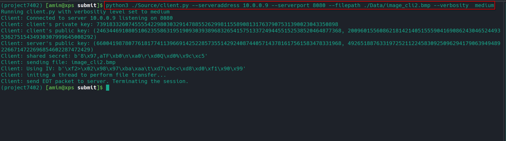
Image files received by the server from client1:

/Data/save_directory/image_cli1.bmp
Image files received by the server from client2:

/Data/save_directory/image_cli2.bmp
Using linux `diff` command to demonstrate that files sent from client1 and client2 are identical:

#### Test Case 5 

| Machine | Test Case Commands |
| --- | --- |
| server/msi-pro | python3 ./Source/cipher.py --input ./Data/image.bmp --output ./Data/encrypted.bmp --operation encrypt |
| server/msi-pro | python3 ./Source/cipher.py --input ./Data/encrypted.bmp --output ./Data/decrypted.bmp --operation decrypt --mainkey <mainkey> --iv <IV> |

Running the encryption and decryption commands on any machine, in this case the command was run on msi-pro machine:
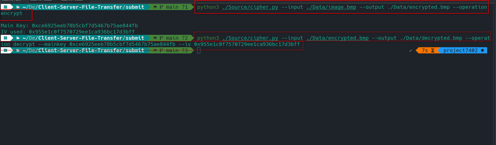
The following shows the image to be used for encryption:

/Data/image.bmp
The following shows the encrypted image:
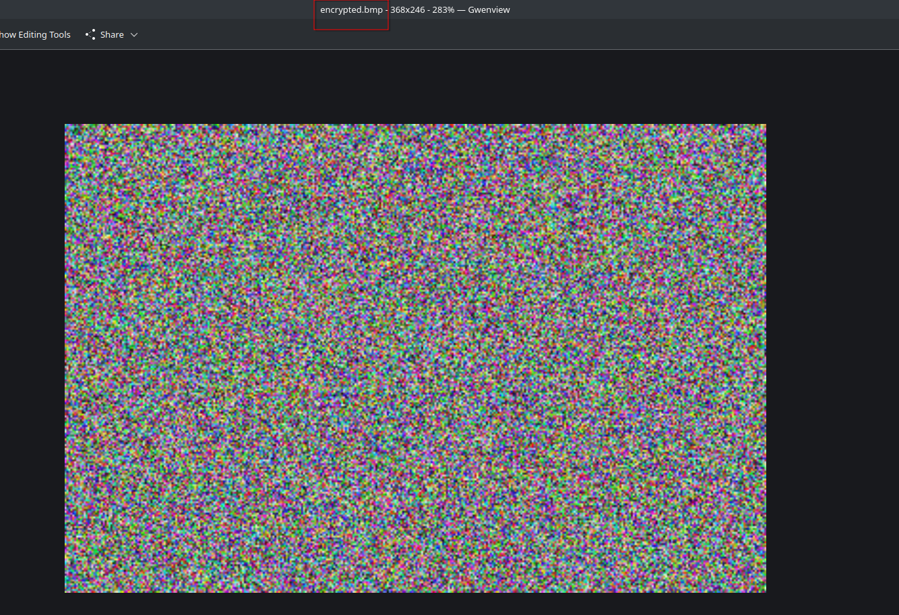
/Data/encrypted.bmp
The following shows the decrypted image:

/Data/decrypted.bmp
Using linux `diff` command to demonstrate that files /Data/image.bmp and /Data/decrypted.bmp are exactly the same:
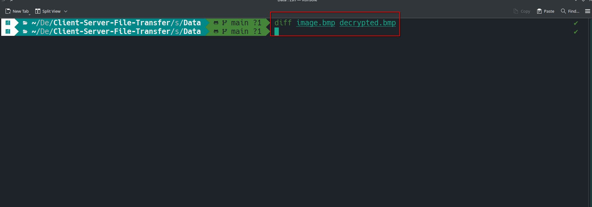

